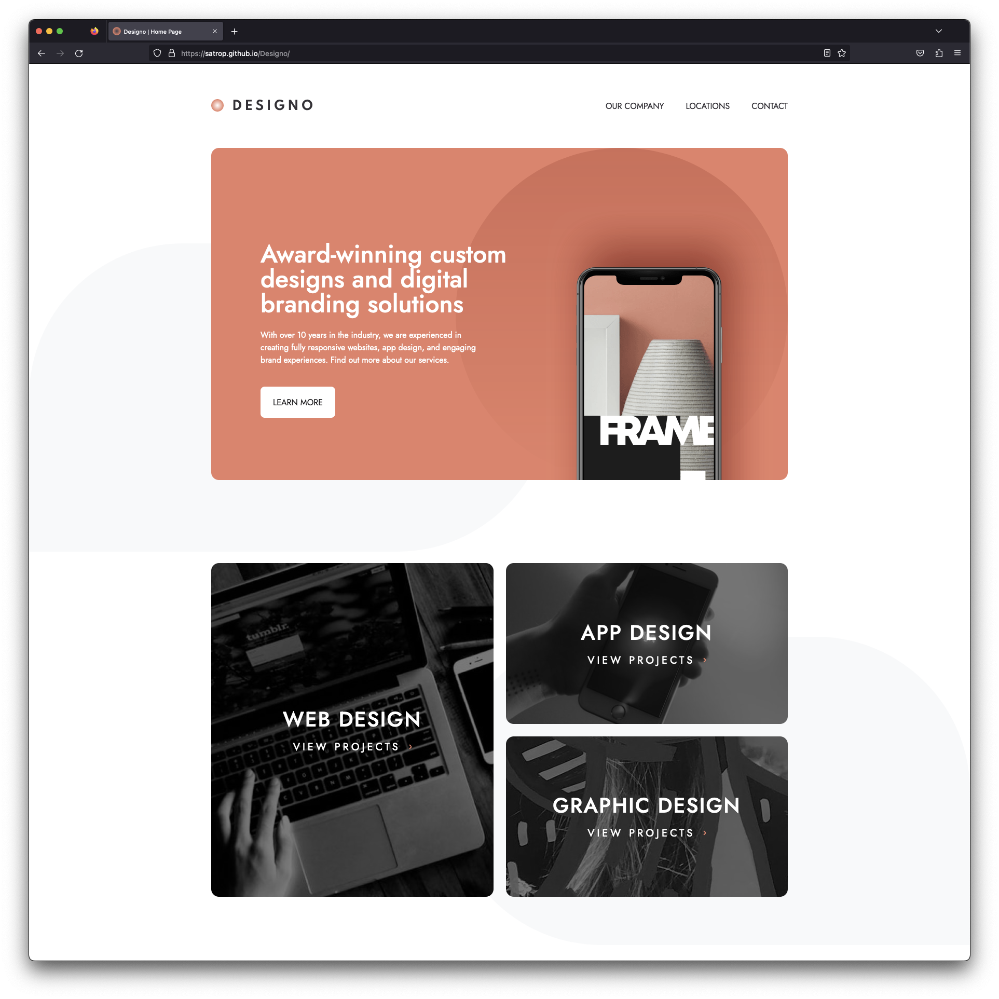

# [Frontend Mentor - Designo](https://www.frontendmentor.io/challenges/designo-multipage-website-G48K6rfUT)

## Overview

-   [Live Site](https://satrop.github.io/Designo/)

## My process

### Built with ❤️

-   Semantic HTML5 markup
-   SCSS with custom properties
-   Flexbox
-   CSS Grid
-   Mobile-first workflow
-   React

Tried my hand at CUBE css and I like most aspects of it but as with anything new it takes a moment to get used to it so I'll keep at it. I found myself using a cross of BEM and CUBE

---

### 📝 Brief

Your challenge is to build out this multi-page website and get it looking as close to the design as possible.

You can use any tools you like to help you complete the challenge. So if you've got something you'd like to practice, feel free to give it a go.

Your users should be able to:

- View the optimal layout for each page depending on their device's screen size
- See hover states for all interactive elements throughout the site
- Receive an error message when the contact form is submitted if:
    - The Name, Email Address or Your Message fields are empty should show "Can't be empty"
    - The Email Address is not formatted correctly should show "Please use a valid email address"
- Bonus: View actual locations on the locations page maps (we recommend Leaflet JS for this)